<div align="center">

# 🎬 perfil-vintage

### Pacote completo para transformar seu GitHub em um perfil estilo cinema dos anos 30




</div>

## 🎞️ O que é

Este é o pacote **open source** do meu próprio perfil: banner SVG animado,
personagens cartoon, faixas de seção estilo cartaz de cinema e um site completo
hospedado no GitHub Pages. Você pode usar tudo de graça para personalizar seu
próprio perfil seguindo o `INSTALAR.md`.

> **Quer um perfil único e personalizado?** Eu crio personagem no seu estilo,
> escrevo seu conteúdo e monto tudo pra você. Me chama em
> [Terabyteplay@gmail.com](mailto:Terabyteplay@gmail.com) ou
> [LinkedIn](https://www.linkedin.com/in/jvitorop).

## 📦 O que tem no pacote

| Componente | Descrição |
|---|---|
| **Banner SVG** | Animado nativamente (olhos piscando, braços se mexendo, balão de fala rotativo) — funciona direto no GitHub |
| **Personagens** | PNGs transparentes em várias poses para decorar README e site |
| **Faixas de seção** | "Cartazes de cinema" entre as seções do README, geradas por script |
| **Site completo** | Template GitHub Pages com paleta vintage, animações de scroll e contadores |

## ⚡ Instalação rápida

```
1. Clone este repositório
2. Copie banner/banner-base.svg para o seu repo de perfil (mesmo nome do usuário)
3. Siga o INSTALAR.md passo a passo
```

Veja o **resultado real** em:
- [Meu perfil no GitHub](https://github.com/JayV1I)
- [Meu site](https://jayv1i.github.io/JayV1I/)
- [Meu currículo](https://jayv1i.github.io/curriculo/)

## 🎨 Personalização

Tudo é editável em arquivo de texto:
- **Nome e frases do balão** → `banner/banner-base.svg`
- **Títulos das seções** → `faixas/gerar-faixas.py`
- **Cores do site** → `site/style.css` (paleta sépia em variáveis CSS)
- **Conteúdo das páginas** → `site/index.html`

## 📜 Licença

O **código e os templates** deste repositório são abertos para uso pessoal e
estudo. A **venda do serviço de personalização** (perfis sob medida para
clientes) é exclusiva do autor. Comercializar os assets sem personalização
não é permitido.

Feito com tinta, papel e um pouco de Python • Est. 2026 • @JayV1I
